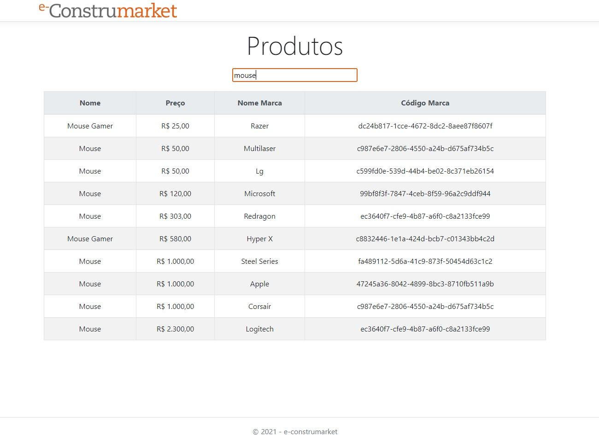

# e-construmarket-mvc

# Para testar o projeto:
1. Clone o repositório em um diretório local;
2. Mude o diretório atual até chegar no diretório do projeto (onde está o arquivo `.csproj`); e
3. Execute o comando `dotnet run` (ou clique em IIS Express se estiver usando o Visual Studio). 

# Informações importantes

Para testar seu comportamento principal, é importante que a aplicação e-construmarket (WebAPI) esteja em execução. 

Basta fazer seu `git clone` atráves [deste link](https://github.com/JustAn0therDev/e-construmarketWebAPI.git).
